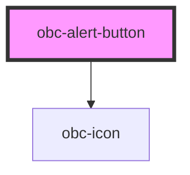

# obc-alert-button

<!-- Auto Generated Below -->

## Properties

| Property     | Attribute    | Description | Type                                                                                                                                                                   | Default             |
| ------------ | ------------ | ----------- | ---------------------------------------------------------------------------------------------------------------------------------------------------------------------- | ------------------- |
| `counter`    | `counter`    |             | `boolean`                                                                                                                                                              | `false`             |
| `nAlerts`    | `n-alerts`   |             | `number`                                                                                                                                                               | `0`                 |
| `standalone` | `standalone` |             | `boolean`                                                                                                                                                              | `false`             |
| `type`       | `type`       |             | `AlertType.Alarm \| AlertType.Caution \| AlertType.Command \| AlertType.Flat \| AlertType.Notification \| AlertType.Regular \| AlertType.Running \| AlertType.Warning` | `AlertType.Regular` |

## Dependencies

### Depends on

- [obc-icon](../obc-icon)

### Graph

----------------------------------------------

*Built with [StencilJS](https://stenciljs.com/)*
