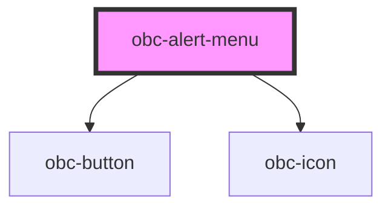

# obc-alert-menu

<!-- Auto Generated Below -->

## Properties

| Property | Attribute | Description | Type      | Default |
| -------- | --------- | ----------- | --------- | ------- |
| `alerts` | --        |             | `Alert[]` | `[]`    |
| `narrow` | `narrow`  |             | `boolean` | `false` |

## Dependencies

### Depends on

- [obc-button](../obc-button)
- [obc-icon](../obc-icon)

### Graph

----------------------------------------------

*Built with [StencilJS](https://stenciljs.com/)*
