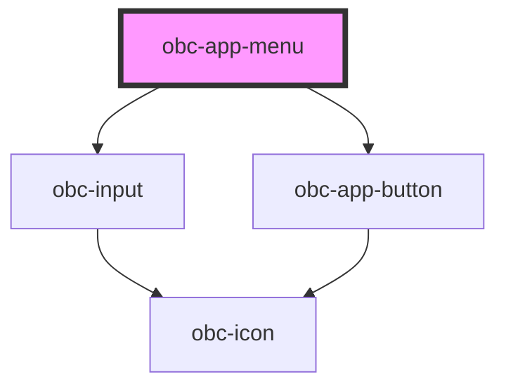

# obc-app-menu

<!-- Auto Generated Below -->

## Properties

| Property         | Attribute          | Description | Type         | Default |
| ---------------- | ------------------ | ----------- | ------------ | ------- |
| `items`          | --                 |             | `MenuItem[]` | `[]`    |
| `selectedItemId` | `selected-item-id` |             | `string`     | `''`    |

## Events

| Event         | Description | Type                    |
| ------------- | ----------- | ----------------------- |
| `appSelected` |             | `CustomEvent<MenuItem>` |

## Dependencies

### Depends on

- [obc-input](../obc-input)
- [obc-app-button](../obc-app-button)

### Graph

----------------------------------------------

*Built with [StencilJS](https://stenciljs.com/)*
