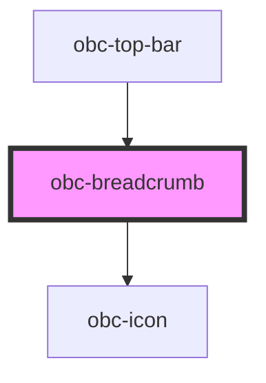

# obc-breadcrumb

<!-- Auto Generated Below -->

## Properties

| Property | Attribute | Description | Type               | Default                  |
| -------- | --------- | ----------- | ------------------ | ------------------------ |
| `items`  | --        |             | `BreadcrumbItem[]` | `[] as BreadcrumbItem[]` |

## Dependencies

### Used by

 - [obc-top-bar](../obc-top-bar)

### Depends on

- [obc-icon](../obc-icon)

### Graph

----------------------------------------------

*Built with [StencilJS](https://stenciljs.com/)*
