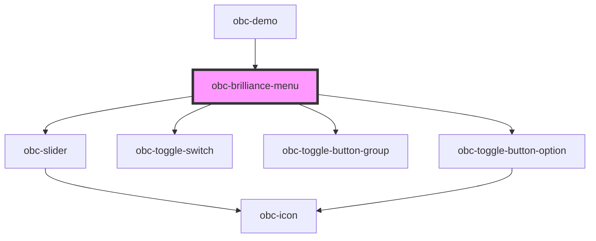

# obc-brilliance-menu

<!-- Auto Generated Below -->

## Events

| Event               | Description | Type                              |
| ------------------- | ----------- | --------------------------------- |
| `brillianceChanged` |             | `CustomEvent<{ value: number; }>` |

## Dependencies

### Used by

 - [obc-demo](../obc-demo)

### Depends on

- [obc-slider](../obc-slider)
- [obc-toggle-switch](../obc-toggle-switch)
- [obc-toggle-button-group](../obc-toggle-button-group)
- [obc-toggle-button-option](../obc-toggle-button-option)

### Graph

----------------------------------------------

*Built with [StencilJS](https://stenciljs.com/)*
