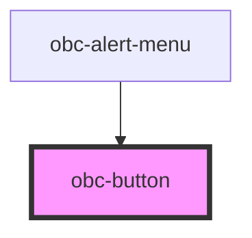

# obc-button

<!-- Auto Generated Below -->

## Overview

Button component

## Properties

| Property    | Attribute    | Description | Type      | Default     |
| ----------- | ------------ | ----------- | --------- | ----------- |
| `fullWidth` | `full-width` |             | `boolean` | `false`     |
| `leftAlign` | `left-align` |             | `boolean` | `false`     |
| `size`      | `size`       |             | `string`  | `"regular"` |
| `variant`   | `variant`    |             | `string`  | `"normal"`  |

## Dependencies

### Used by

 - [obc-alert-menu](../obc-alert-menu)

### Graph

----------------------------------------------

*Built with [StencilJS](https://stenciljs.com/)*
