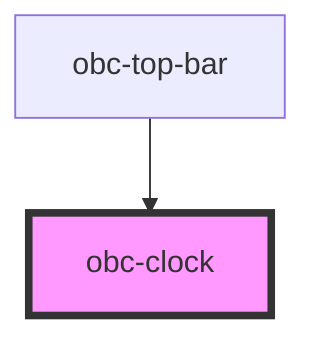

# obc-clock

<!-- Auto Generated Below -->

## Properties

| Property   | Attribute   | Description | Type      | Default                      |
| ---------- | ----------- | ----------- | --------- | ---------------------------- |
| `date`     | `date`      |             | `string`  | `"2021-01-01T11:11:11.111Z"` |
| `showDate` | `show-date` |             | `boolean` | `false`                      |

## Dependencies

### Used by

 - [obc-top-bar](../obc-top-bar)

### Graph

----------------------------------------------

*Built with [StencilJS](https://stenciljs.com/)*
