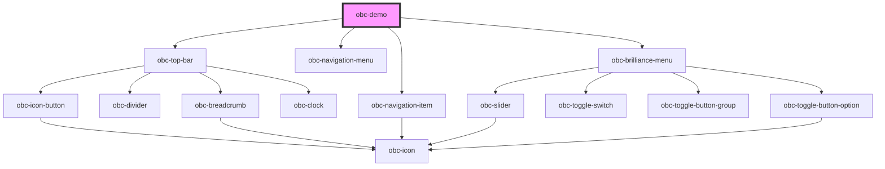

# obc-demo

<!-- Auto Generated Below -->

## Dependencies

### Depends on

- [obc-top-bar](../obc-top-bar)
- [obc-navigation-menu](../obc-navigation-menu)
- [obc-navigation-item](../obc-navigation-item)
- [obc-brilliance-menu](../obc-brilliance-menu)

### Graph

----------------------------------------------

*Built with [StencilJS](https://stenciljs.com/)*
