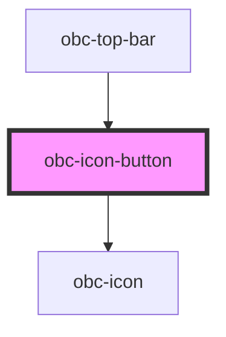

# obc-icon-button

<!-- Auto Generated Below -->

## Properties

| Property      | Attribute      | Description | Type      | Default            |
| ------------- | -------------- | ----------- | --------- | ------------------ |
| `activeColor` | `active-color` |             | `boolean` | `false`            |
| `cornerLeft`  | `corner-left`  |             | `boolean` | `false`            |
| `cornerRight` | `corner-right` |             | `boolean` | `false`            |
| `icon`        | `icon`         |             | `string`  | `'01-placeholder'` |
| `size`        | `size`         |             | `string`  | `"regular"`        |
| `variant`     | `variant`      |             | `string`  | `"normal"`         |

## Dependencies

### Used by

 - [obc-top-bar](../obc-top-bar)

### Depends on

- [obc-icon](../obc-icon)

### Graph

----------------------------------------------

*Built with [StencilJS](https://stenciljs.com/)*
