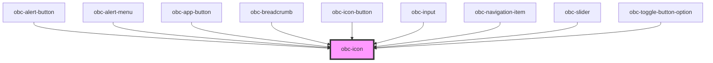

# obc-icon

<!-- Auto Generated Below -->

## Properties

| Property      | Attribute       | Description             | Type      | Default     |
| ------------- | --------------- | ----------------------- | --------- | ----------- |
| `iconId`      | `icon-id`       | The icon name           | `string`  | `undefined` |
| `sizePx`      | `size-px`       | The icon size in pixels | `number`  | `24`        |
| `useCssColor` | `use-css-color` |                         | `boolean` | `false`     |

## Dependencies

### Used by

 - [obc-alert-button](../obc-alert-button)
 - [obc-alert-menu](../obc-alert-menu)
 - [obc-app-button](../obc-app-button)
 - [obc-breadcrumb](../obc-breadcrumb)
 - [obc-icon-button](../obc-icon-button)
 - [obc-input](../obc-input)
 - [obc-navigation-item](../obc-navigation-item)
 - [obc-slider](../obc-slider)
 - [obc-toggle-button-option](../obc-toggle-button-option)

### Graph

----------------------------------------------

*Built with [StencilJS](https://stenciljs.com/)*
