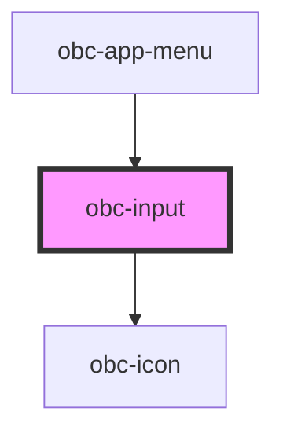

# obc-input

<!-- Auto Generated Below -->

## Properties

| Property      | Attribute     | Description | Type     | Default  |
| ------------- | ------------- | ----------- | -------- | -------- |
| `icon`        | --            |             | `String` | `""`     |
| `placeholder` | `placeholder` |             | `string` | `""`     |
| `type`        | `type`        |             | `string` | `"text"` |
| `value`       | `value`       |             | `string` | `""`     |

## Dependencies

### Used by

 - [obc-app-menu](../obc-app-menu)

### Depends on

- [obc-icon](../obc-icon)

### Graph

----------------------------------------------

*Built with [StencilJS](https://stenciljs.com/)*
