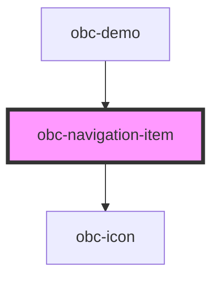

# obc-navigation-item

<!-- Auto Generated Below -->

## Properties

| Property  | Attribute | Description | Type      | Default            |
| --------- | --------- | ----------- | --------- | ------------------ |
| `checked` | `checked` |             | `boolean` | `false`            |
| `href`    | `href`    |             | `string`  | `'#'`              |
| `icon`    | `icon`    |             | `string`  | `'01-placeholder'` |
| `label`   | `label`   |             | `string`  | `'Label'`          |

## Dependencies

### Used by

 - [obc-demo](../obc-demo)

### Depends on

- [obc-icon](../obc-icon)

### Graph

----------------------------------------------

*Built with [StencilJS](https://stenciljs.com/)*
