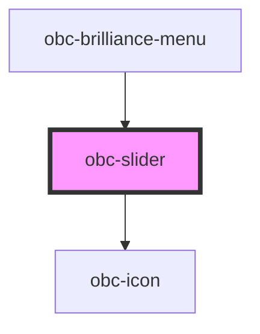

# obc-slider

<!-- Auto Generated Below -->

## Properties

| Property    | Attribute    | Description | Type     | Default            |
| ----------- | ------------ | ----------- | -------- | ------------------ |
| `iconLeft`  | `icon-left`  |             | `string` | `'01-placeholder'` |
| `iconRight` | `icon-right` |             | `string` | `'01-placeholder'` |
| `max`       | `max`        |             | `number` | `100`              |
| `min`       | `min`        |             | `number` | `0`                |
| `step`      | `step`       |             | `number` | `1`                |
| `value`     | `value`      |             | `number` | `50`               |

## Dependencies

### Used by

 - [obc-brilliance-menu](../obc-brilliance-menu)

### Depends on

- [obc-icon](../obc-icon)

### Graph

----------------------------------------------

*Built with [StencilJS](https://stenciljs.com/)*
