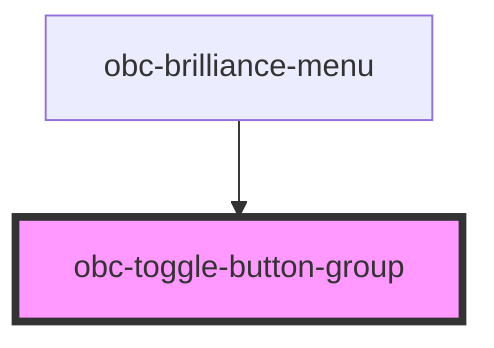

# obc-toggle-button-group

<!-- Auto Generated Below -->

## Properties

| Property    | Attribute    | Description | Type      | Default |
| ----------- | ------------ | ----------- | --------- | ------- |
| `hasLabels` | `has-labels` |             | `boolean` | `false` |
| `value`     | `value`      |             | `string`  | `''`    |

## Events

| Event          | Description | Type                              |
| -------------- | ----------- | --------------------------------- |
| `valueChanged` |             | `CustomEvent<{ value: string; }>` |

## Dependencies

### Used by

 - [obc-brilliance-menu](../obc-brilliance-menu)

### Graph

----------------------------------------------

*Built with [StencilJS](https://stenciljs.com/)*
