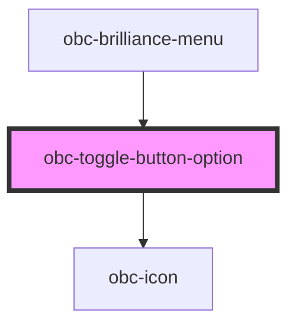

# obc-toggle-button-option

<!-- Auto Generated Below -->

## Properties

| Property   | Attribute  | Description | Type      | Default            |
| ---------- | ---------- | ----------- | --------- | ------------------ |
| `icon`     | `icon`     |             | `string`  | `'01-placeholder'` |
| `selected` | `selected` |             | `boolean` | `false`            |
| `value`    | `value`    |             | `string`  | `'value'`          |

## Events

| Event      | Description | Type                              |
| ---------- | ----------- | --------------------------------- |
| `selected` |             | `CustomEvent<{ value: string; }>` |

## Dependencies

### Used by

 - [obc-brilliance-menu](../obc-brilliance-menu)

### Depends on

- [obc-icon](../obc-icon)

### Graph

----------------------------------------------

*Built with [StencilJS](https://stenciljs.com/)*
