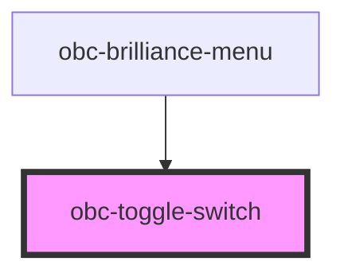

# obc-toggle-switch

<!-- Auto Generated Below -->

## Properties

| Property  | Attribute | Description | Type      | Default   |
| --------- | --------- | ----------- | --------- | --------- |
| `checked` | `checked` |             | `boolean` | `false`   |
| `label`   | `label`   |             | `string`  | `'Label'` |

## Dependencies

### Used by

 - [obc-brilliance-menu](../obc-brilliance-menu)

### Graph

----------------------------------------------

*Built with [StencilJS](https://stenciljs.com/)*
