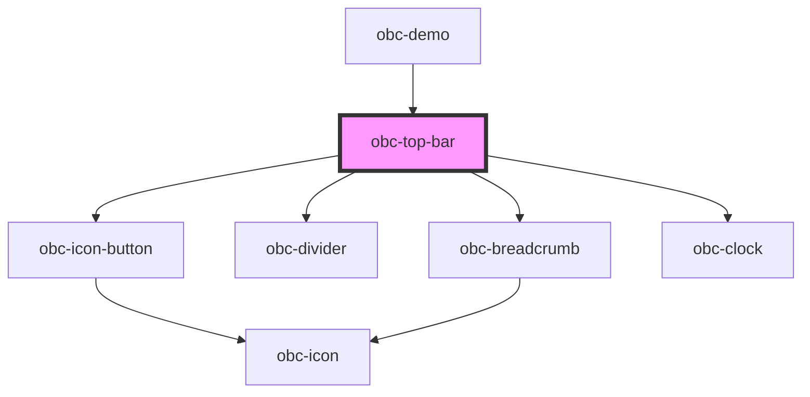

# obc-top-bar

<!-- Auto Generated Below -->

## Properties

| Property            | Attribute             | Description | Type               | Default                      |
| ------------------- | --------------------- | ----------- | ------------------ | ---------------------------- |
| `appTitle`          | `app-title`           |             | `string`           | `'App'`                      |
| `breadcrumbItems`   | --                    |             | `BreadcrumbItem[]` | `[]`                         |
| `date`              | `date`                |             | `string`           | `"2021-01-01T11:11:11.111Z"` |
| `inactive`          | `inactive`            |             | `boolean`          | `false`                      |
| `pageName`          | `page-name`           |             | `string`           | `'Page'`                     |
| `settings`          | `settings`            |             | `boolean`          | `false`                      |
| `showAlertsButton`  | `show-alerts-button`  |             | `boolean`          | `false`                      |
| `showAppsButton`    | `show-apps-button`    |             | `boolean`          | `false`                      |
| `showClock`         | `show-clock`          |             | `boolean`          | `false`                      |
| `showDimmingButton` | `show-dimming-button` |             | `boolean`          | `false`                      |
| `sizeSmall`         | `size-small`          |             | `boolean`          | `false`                      |
| `wideMenuButton`    | `wide-menu-button`    |             | `boolean`          | `false`                      |

## Events

| Event                   | Description | Type               |
| ----------------------- | ----------- | ------------------ |
| `alertsButtonClicked`   |             | `CustomEvent<any>` |
| `appsButtonClicked`     |             | `CustomEvent<any>` |
| `back`                  |             | `CustomEvent<any>` |
| `close`                 |             | `CustomEvent<any>` |
| `dimmingButtonClicked`  |             | `CustomEvent<any>` |
| `forward`               |             | `CustomEvent<any>` |
| `leftMoreButtonClicked` |             | `CustomEvent<any>` |
| `menuButtonClicked`     |             | `CustomEvent<any>` |

## Dependencies

### Used by

 - [obc-demo](../obc-demo)

### Depends on

- [obc-icon-button](../obc-icon-button)
- [obc-divider](../obc-divider)
- [obc-breadcrumb](../obc-breadcrumb)
- [obc-clock](../obc-clock)

### Graph

----------------------------------------------

*Built with [StencilJS](https://stenciljs.com/)*
